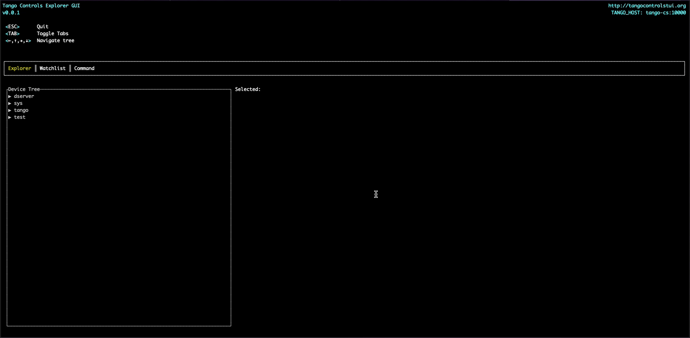
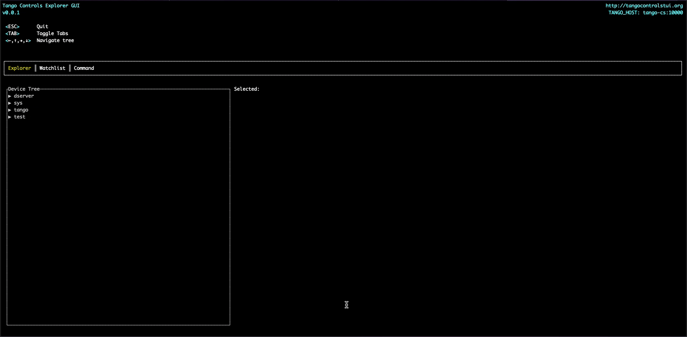
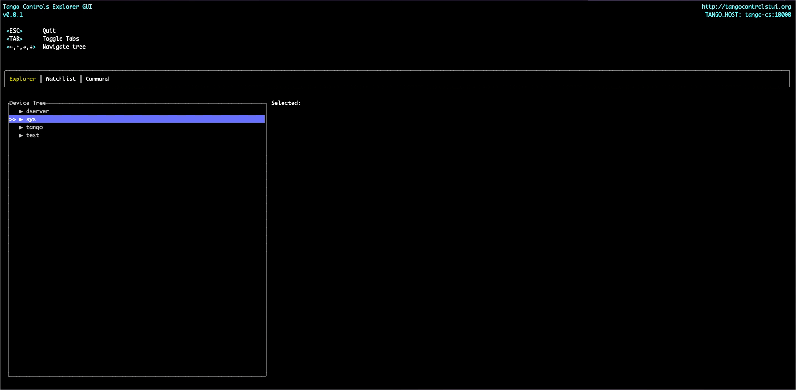

# Tango Controls TUI

TUI to explore Tango devices

## Features

- Browse the running Tango devices in a tree structure
- List the device commands
    - Name
    - Type In
    - Type Out
- List the device attributes
    - Name
    - Type
    - Format
    - Description
- Watch attribute values
    - The attribute will be polled and its value displayed
- Execute commands

### Browse attributes and commands



### Watch attribute values



### Execute commands



## Limitations

- WARNING: If your device has attributes of type ENUM it _will_ crash the application if you expand it in the device list.
  - `tango-rs` does not support it.
- Not all attribute types are able to be displayed in the watchlist.
- Attributes in the watchlist are polled sequentially. Thus values may be missed for attributes that update quickly
- Events are not supported

## Known Issues

- When running in some environments where stderr is redirected to stdout you may get some rendering artifacts of error messages.
  - Workaround: Specify a log file E.g `tango-controls-tui -l logile.log`

## Project Goals

- A fast, easy to navigate Tango device explorer
- Watch attributes change values
- Easily run in k8s
- Run in a terminal. No need to set up GUIs/Browser interfaces

## TODO
- [x] Watch attributes
- [ ] Add tests
- [ ] Add ability to remove attribute from watchlist
- [x] Execute commands (`void`, `int` and `str` parameter types)

## Compiling

### Prerequistes

- Rust
- Cargo
- Make sure that the requirements for tango-rs is met. See: https://github.com/birkenfeld/tango-rs

### Compile

```
git clone git@github.com:SKAJohanVenter/tango-controls-tui.git
cd tango-controls-tui
RUSTFLAGS=-Awarnings cargo build --release
```

The binary will be available in `./target/release/tango-controls-tui`

## Docker

### Development in a docker image

```
docker build . -t tui_dev:latest -f ./Dockerfile_dev
docker run --rm -it -v "$(pwd)":/workspace  --env="TANGO_HOST=<TANGO_HOST>:10000" tui_dev:latest /bin/bash

root@6a00adac91ad:/tango-controls-tui# cargo clean
root@6a00adac91ad:/tango-controls-tui# cargo build
...
root@6a00adac91ad:/tango-controls-tui# ./target/debug/tango-controls-tui --help
```

### Build docker

```
git clone git@github.com:SKAJohanVenter/tango-controls-tui.git
cd tango-controls-tui
docker build . -t <TAG_NAME> -f ./Dockerfile
```

### Run with `kubectl`

```
kubectl run tui --rm  -it --image=ajohanv/tango-controls-tui:0.0.1 --restart=Never -n <NAMESPACE> --env="TANGO_HOST=<TANGO_HOST>:10000" /bin/bash
root@tui3:/# tango-controls-tui -l t.log
```
