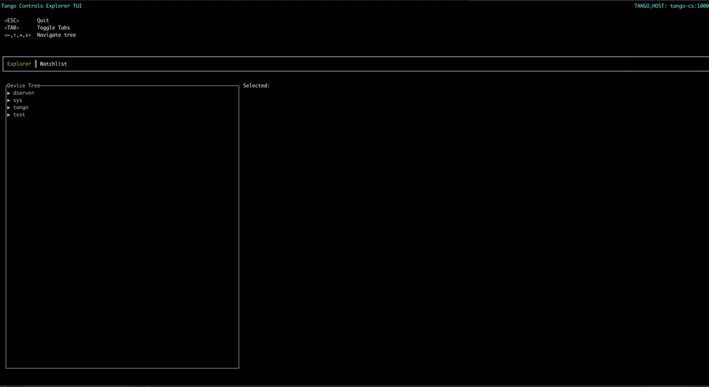

# tango-controls-tui

TUI to explore Tango devices



## Goals

- A fast, easy to navigate Tango device explorer
- Watch attributes change values
- Easily run in k8s
- Remove the requirement of a browser/GUI to explore devices and attribute values

## Features

- Browse the running Tango devices in a tree structure
- List the device commands
    - Name
    - Type In
    - Type Out
- List the device attributes
    - Name
    - Description
- Add an attribute to the watchlist
    - The attribute will be polled and it's value displayed

## TODO
- [x] Watch attributes
- [ ] Add tests
- [ ] Add ability to remove attribute from watchlist
- [ ] Execute commands (`void`, `int` and `str` parameter types)

## Limitations

- Not all attribute types are able to be displayed in the watchlist.
- Attributes in the watchlist are polled sequentially. Thus values may be missed for attributes that update quickly
- Events are not supported

## Compiling

### Prerequistes

- Rust
- Cargo
- Make sure that the requirements for tango-rs is met. See: https://github.com/birkenfeld/tango-rs

### Compile

```
git clone git@github.com:SKAJohanVenter/tango-controls-tui.git
cd tango-controls-tui
RUSTFLAGS=-Awarnings cargo build --release
```

The binary will be available in `./target/release/tango-controls-tui`

## Docker

## Build docker

```
git clone git@github.com:SKAJohanVenter/tango-controls-tui.git
cd tango-controls-tui
DOCKER_BUILDKIT=0 COMPOSE_DOCKER_CLI_BUILD=0  docker build . -t <TAG_NAME> -f ./Dockerfile
```

### Run with `kubectl`

```
kubectl run tui --rm  -it --image=ajohanv/tango-controls-tui:0.0.1-beta-0 --restart=Never -n <NAMESPACE> --env="TANGO_HOST=<TANGO_HOST>:10000"  /bin/bash
root@tui3:/# tango-controls-tui
```